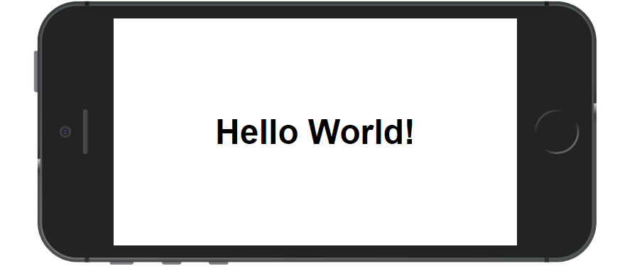

# _Web App Manifest API_

Exemplo de uso da tag de _Web App Manifest_ do HTML5.

## Links do Exemplo

- Link para seminário: [slides de aula][slides]
- Link para exemplo publicado: [página no GitHub][vivo]

## Créditos

Este trabalho foi realizado em 2019/01 para a disciplina de Programação para Web do CEFET-MG no Campus II de Belo Horizonte.

Autores:

1. Larissa de Cássia Nazaré Bicalho (201512040304)
2. Vinicius Henrique Silveira (201422040046)

Atribuições:

- MDN Web App Manifest Doc [Link][mdn-link]

[slides]: https://drive.google.com/open?id=1Rgj1jiePudbVQtuaz9k7twZlx4Wl0KS9leQtBIns5lc
[vivo]:https://silveiravinicius.github.io/cefet-web-weblot-web-app-manifest/
[mdn-link]:https://developer.mozilla.org/en-US/docs/Web/Manifest
